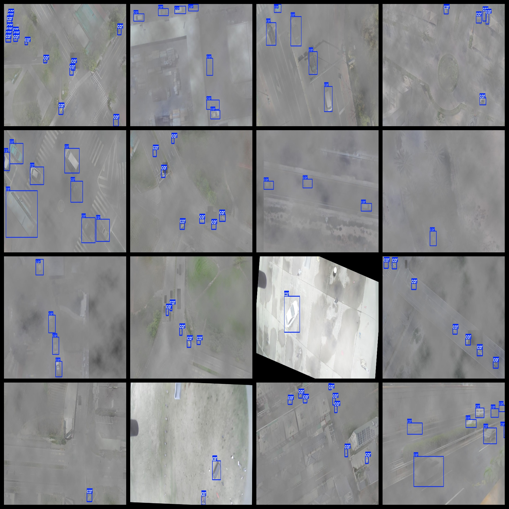
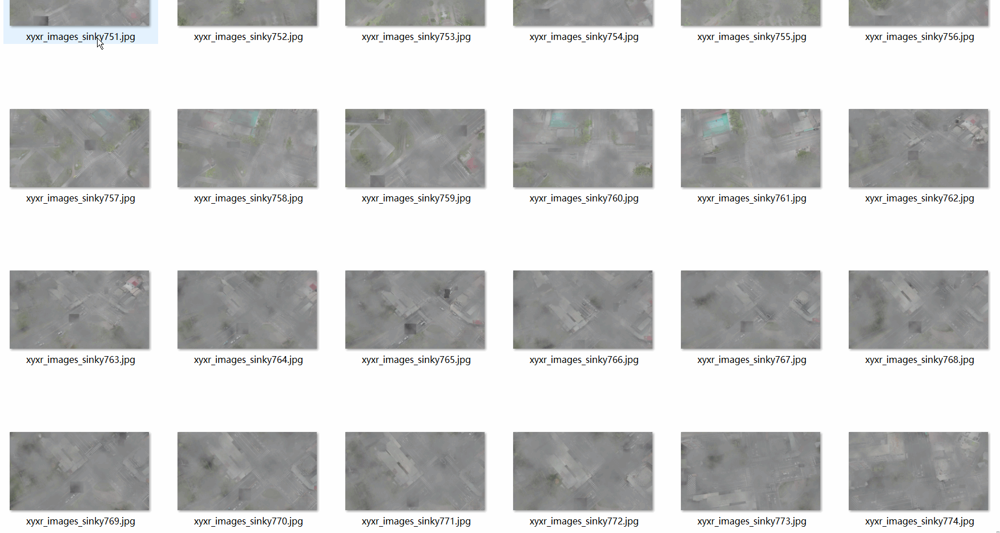

# High-Altitude Aerial Cloud Fog Under Gas Vehicle Dataset 5027 imagesVOC+YOLO format

Vehicle dataset under aerial aerial photography cloud fog 5027 VOC + YOLO format

Dataset format: Pascal VOC format + YOLO format (the txt file does not contain the split path, it only contains jpg images and corresponding VOC format xml files and yolo format txt files)

Number of images (number of jpg files): 5027

Number of xml files: 5027

Number of txt files: 5027

Number of categories: 1

The Github repository is: datasets_sl

Annotation class names: ["car"]

Number of boxes labeled in each category:

Car frame numbers = 27375

Total frames: 27375

Number of images per category:

car occupancy = 5027

Image resolution: Multi-resolution images, such as 1845x750, 900x600 and so on.

Use the labeling tool: labelImg

Dataset Augmentation: Yes

Rules for annotation: Draw a rectangle around the category.

Important note: The dataset does not have been divided into training, validation, and testing sets.

Special Disclaimer: This dataset does not guarantee the accuracy of the trained models or weight files.

Annotation and image details are as follows:

## Images

---

Here is a pay link on Stripe (https://buy.stripe.com/3cs8yP7sY87d0vu9AB). Please contact me lonlonago@foxmail.com after funding $89, and I will send you a complete data files, thank you!

